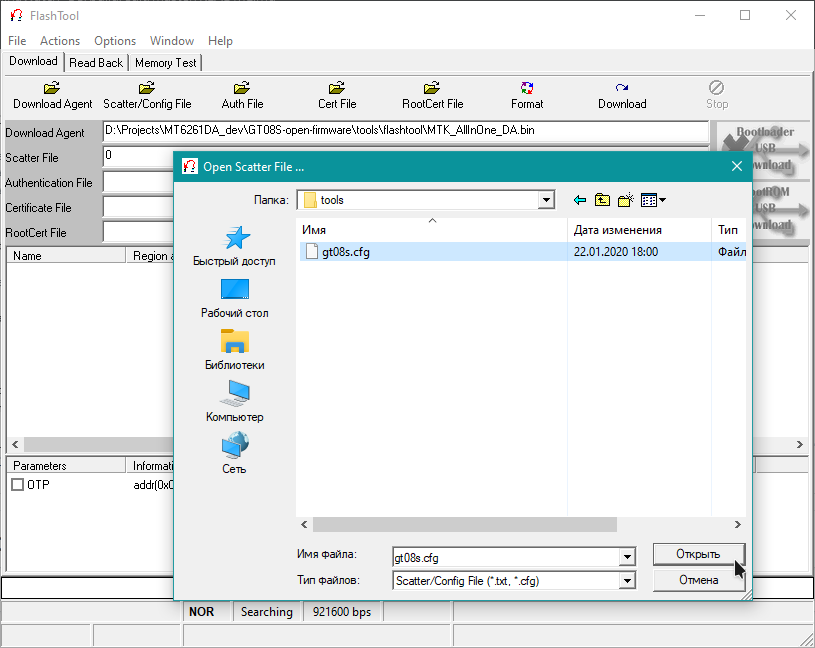
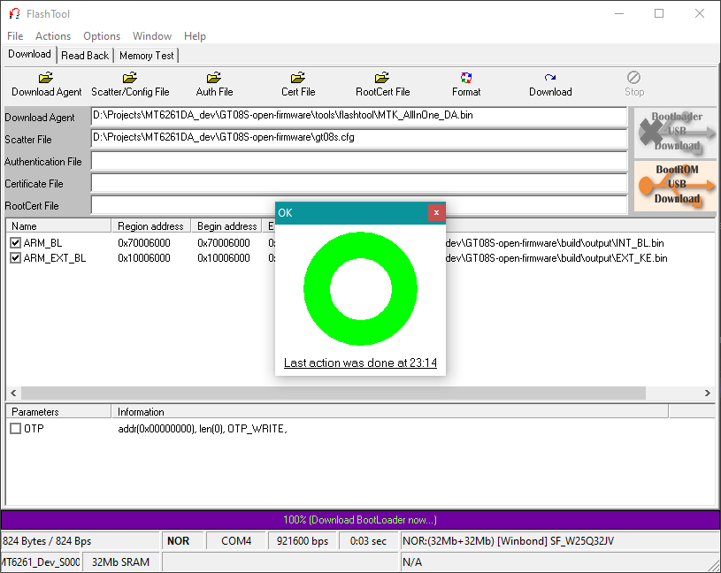

# MT6261 OS
## This is a fork of the [DZ09](https://github.com/MediatekInfo/DZ09) repository.
### Fork ChinaWatch OS project

This project was created with the aim of writing free firmware for various сhinese smartwatches, phones based on the Mediatek 6261 platform. The main devices for which the firmware is being developed are GT-08S, DZ09 and Phones.

# Compiling
**1. Installing programs**

Download and install the latest version of **FlashTool**. You can obtain this software [here](https://androidmtk.com/download-mtk-flash-tool).

Download and install **arm-none-eabi-gcc** crosscompiler. For Windows you can get it [here](https://gnutoolchains.com/arm-eabi/).

Download and install **CMake**. You can get it [here](https://cmake.org/download/).

**2. Setting up your copy of the code**

Clone repository
```
cd build
git submodule update --init --recursive
```

**3. Compiling**

Configure CMake project
```
cmake --no-warn-unused-cli -DCMAKE_EXPORT_COMPILE_COMMANDS:BOOL=TRUE -DCMAKE_BUILD_TYPE:STRING=Debug -DCMAKE_C_COMPILER:FILEPATH=arm-none-eabi-gcc.exe -DCMAKE_CXX_COMPILER:FILEPATH=arm-none-eabi-g++.exe -DCMAKE_TOOLCHAIN_FILE:FILEPATH=GT08S.cmake -H. -Bbuild -G "Unix Makefiles"
```

Build project
```
cmake --build build --config Debug --target all -- -j 4
```
# Flashing
**1. Run FlashTool, click on the ```Scatter/Config File``` button, select file ```gt08s.cfg``` from folder ```tools```**



**2. Click on the ```Download``` button, connect the device and wait. After a while a window with a green circle will appear**



# Licensing
Licensed under the GNU GPL-3.0 license (see [LICENSE](LICENSE)).

/tools/mtk_signer.exe is licensed under the GNU GPL-2.0 license and its source code can be obtained [here](https://github.com/MediatekInfo/mtk_sign).
